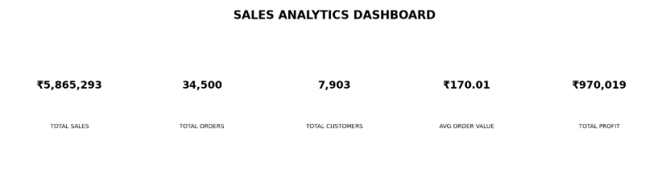
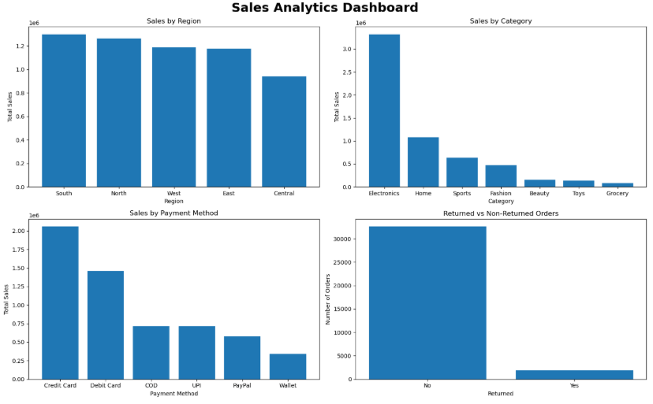
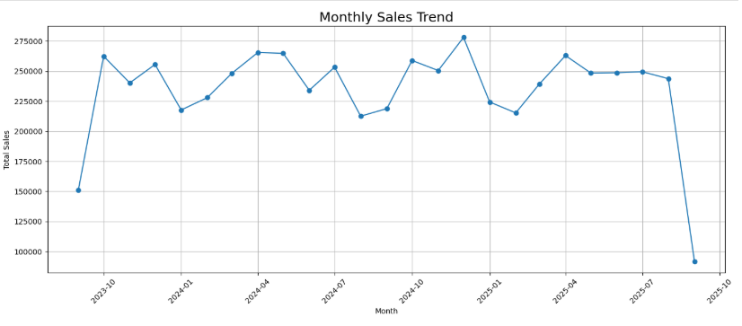

# 📊 Sales Analytics Dashboard

## 📌 Project Overview

The Sales Analytics Dashboard is a data analytics project that analyzes sales transactions to identify business performance, customer behavior, regional trends, product category performance, profitability, returns, payment preferences, and delivery performance.

The project uses Python for data cleaning, exploratory data analysis, and visualization, while MySQL is used for structured business analysis using SQL.

---

## 🎯 Project Objectives

- Analyze overall sales performance
- Identify high-performing regions
- Analyze product category performance
- Understand customer purchasing behavior
- Analyze payment methods
- Measure order return rates
- Analyze profitability
- Evaluate delivery performance
- Identify top customers and products
- Generate actionable business insights

---

## 🛠️ Technologies Used

- Python
- Pandas
- NumPy
- Matplotlib
- Seaborn
- Jupyter Notebook
- MySQL
- SQL

---

# 📁 Project Structure

```text
Sales Analytics Dashboard/
│
├── dataset/
│   └── sales.csv
│
├── images/
│   ├── dashboard_kpis.png
│   ├── dashboard_charts.png
│   └── monthly_sales_trend.png
│
├── Sales_Analytics.ipynb
├── sql_queries.sql
└── README.md
```

# 📊 Dashboard Analysis

## KPI Dashboard



## Sales Analysis Charts



## Monthly Sales Trend

